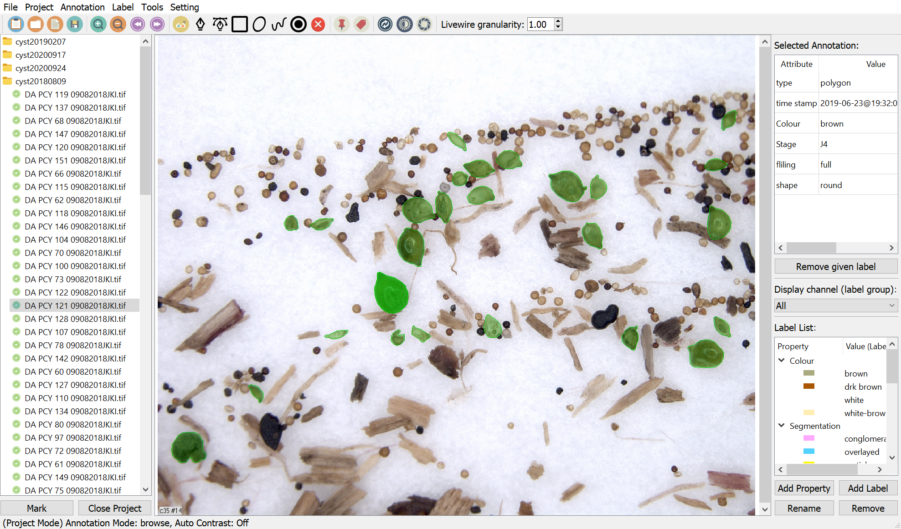

# IMANNO (IMage ANNOtation toolkit)
An image annotation toolkit   
by Institut of Imaging & Computer Vision, RWTH Aachen University, Germany
(https://www.lfb.rwth-aachen.de/en/)



## Dependencies:

- python = 3.5
- opencv = 3.4 
- pyqt = 5.9
- h5py = 2.8

optional:
- pyinstaller

### Set up you own python environment
We recommend using anaconda to setup the enironment:
env.yml list the complete packages, which can be easily used by conda: 
```
conda env create -f env.yml
```

/release_MM_YYYY/ contains an independent executable for windows users

## Features:

### Drawing
Polygons, Ellipses, Bounding Box, Dot

### Labeling

Label docker on the right side:
- add new attributes
- add new labels to an attribute
- save current attributes and labels as default
- load default

Give labels:
- double click to select (+Ctrl for multiple selection)
- double click a label in the label docker to give that label to selected objects

Display channel (attribute):
- objects displayed with different colors based on the labels of the selectes attribute channel
- objecst without a label will be black 

### Annotation formats

Annotations are saved in .hdf5 file with the same name of the image. Some tools are provided to export the annotations as other formats.

#### .hdf5 structure
/annotations/<timestamp_of_annotation>(attr:type, timestamp)  
/annotations/<timestamp_of_annotation>/labels/<attribute_name>(attr: label_name)   
/attributes/attr_names/<label_name>

Polygon:  
- /annotations/<timestamp_of_annotation>/boundingBox:(4,)
- /annotations/<timestamp_of_annotation>/polygon:(N,2)

Bouding box:  
- /annotations/<timestamp_of_annotation>/boundingBox:(4,)   

Ellipse:  
- /annotations/<timestamp_of_annotation>/center:(2,)  
- /annotations/<timestamp_of_annotation>/angle:(1,)   
- /annotations/<timestamp_of_annotation>/axis:(2,)  

Dot:  
- /annotations/<timestamp_of_annotation>/pt:(2,) 

Data structure
- boundingBox(4,): x, y, w, h  
- polygon(N,2): coordinates  
- center(2,): image coordinate x-right y-down  
- angle(1,): 0 angle - right  
- axis(2,): main axis lenght, side axis length  
- pt(2,): x, y  

#### export annotation as other formats
Edit -> Export Annotations
- mask, single (.png): export segmentation masks in a single image (objects may overlap)
- mask, multiple (.png): exports segmetation masks, each image for an object
- boundingbox (.xml): PASCAL VOC format
- patches (.png): exports an image patch and segmentation patch for each object
- skeleton (.png): exports skeletons of objects

options:
- ignore images without objects annotates: empty images will ignored, otherwise an empty annotation will be generated
- copy images: copy original image to the save folder, together with the exported annotations
- padding (only for patches): add a margin (%) to the patch
- export label of property (only for bounding box): save labels of given property in .xml

## TODOs:

- add config menu
- optimiza GUI

## Export executable (windows10 tested)

- install pyinstaller
- run command: 
```
pyinstaller main.py
```
- copy ./config ./icons ./uis to the directory of your executable (which contains main.exe)
- copy platform directory to the directory of your executable. You'll find the platform directory at a location like c:\Users\<username>\envs\<environmentname>\Library\plugins\platforms

## releases:
- 12.12.2019: support for bmp images; fix line annotation bug; noisy annotation clean based on area